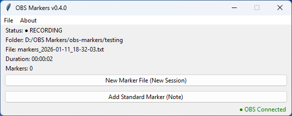
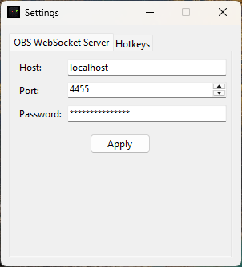
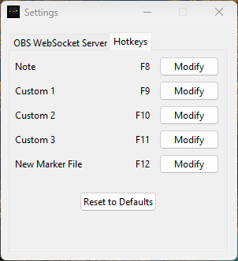
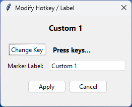

# OBS Markers 


> ⚠️ Pre-alpha software  
> The app is stable for daily use but the data format and features may still change before v1.0. Back up important marker files if you rely on them for critical workflows.  

OBS Markers is a lightweight desktop utility for logging timestamp markers while recording with [OBS Studio](https://obsproject.com/).  
It automatically detects when OBS starts and stops recording, tracks the session duration, and writes timestamped markers to a text file via configurable hotkeys - making it easy to flag key moments while you record.


## Highlights

- Automatic detection of OBS recording start/stop (via OBS WebSocket)
- One marker file per recording session
- Instant timestamp markers via hotkey or in-app button
- Customizable hotkeys via the Settings panel
- Persistent configuration stored in AppData (Windows)
- Clear GUI showing:
  - OBS connection status
  - Recording status
  - Elapsed recording time
  - Active marker file
  - Marker count
- Graceful handling when OBS is closed, unavailable, or restarted
- Standalone Windows `.exe` builds available


<table align="center" cellspacing="16">
  <tr>
    <td align="center" colspan="2">
      
      <div><strong>Main Application Window</strong></div>
    </td>
  </tr>
  <tr>
    <td align="center" width="50%">
      
      <div><strong>OBS WebSocket Settings Panel</strong></div>
    </td>
    <td align="center" width="50%">
      
      <div><strong>Hotkey Settings Panel</strong></div>
    </td>
  </tr>
  <tr>
    <td align="center" colspan="2">
      
      <div><strong>Modify Hotkey Dialog</strong></div>
    </td>
  </tr>
</table>

## Quickstart (2 minutes)

1. Install and open OBS Studio.
2. Enable the WebSocket server: Tools → WebSocket Server Settings.
   - OBS WebSocket 5.x is required.
   - The app defaults to host `localhost` and port `4455`.
3. Launch OBS Markers.
4. Choose a folder for marker files: File → Select New Folder.
5. Start recording in OBS (UI or hotkey). OBS Markers will detect the session and start a new marker file automatically.
6. Press the Add Standard Marker hotkey (default `F8`) to append a timestamp (Note), or use the GUI button.


## Installation

### Windows (Recommended)
Download the latest standalone executable from the [Releases page](https://github.com/slothmock/obs-markers/releases).  
No Python installation required.

### Running from source (Developers)

Prerequisites
- Python 3.11+
- OBS Studio with WebSocket 5.x enabled

Clone the repository:
```bash
git clone https://github.com/slothmock/obs-markers.git
cd obs-markers
```

Install dependencies:
```bash
pip install -r requirements.txt
```

Run the app:
```bash
python -m app
```

---

## First-time Setup

1. Open OBS Studio and enable WebSocket: Tools → WebSocket Server Settings.
2. Launch OBS Markers.
3. File → Select New Folder to pick where marker files will be saved.
4. Start recording in OBS. OBS Markers will detect the recording and create a new marker file automatically.

Notes:
- The default connection is `localhost:4455`. If you change OBS WebSocket host/port or set a password, they will need to be updated:  
  `File → Settings → OBS WebSocket Server`  

- If OBS Markers fails to connect, see [Troubleshooting](#troubleshooting) below.

---

## Usage

### Hotkeys
Hotkeys are configurable under File → Settings → Hotkeys.

| Action       | Default |
| ------------ | ------- |
| New File     | F12     |
| Add Marker   | F8      |
| Custom 1     | F9      |
| Custom 2     | F10     |
| Custom 3     | F11     |


- Hotkeys are global (they work even when OBS or other windows are focused).
- Changes to hotkeys apply immediately - no restart required.

### Marker Files
- Stored in the folder you select.
- Automatically named using the recording start time:
  ```
  markers_YYYY-MM-DD_HH-MM-SS.txt
  ```
- Files are UTF-8 plain text.
- Filenames and session timestamps use the system's local time.
- In-file timestamps are elapsed times relative to the session start.

Example marker file:
```txt
=== SESSION START 2025-12-29 16:29:09 ===
00:00:08 Note
00:00:12 Funny moment
00:00:20 Custom 2
=== SESSION END | Duration: 00:00:30 ===
```

Marker semantics:
- Session start/end markers are written automatically.
- Manual markers append as HH:MM:SS elapsed time from session start + the respective label.
- If OBS restarts mid-session the file will contain the current session's markers; a new recording after restart will create a new file.

---

## Settings & Configuration

Configuration is stored using `appdirs` in the OS-appropriate config directory.

| OS      | Example path                                           | Tested
| ------- | ------------------------------------------------------ | ----- 
| Windows | `C:\Users\<user>\AppData\Local\OBSMarkers\config.json` | [ x ]
| macOS   | `~/Library/Application Support/OBSMarkers/config.json` | [  ] 
| Linux   | `~/.config/OBSMarkers/config.json`                     | [  ]

Example config.json:
```json
{
  "obs": {
    "host": "localhost",
    "port": 4455,
    "password": "supersecretpass"
  },
  "hotkeys": {
    "note": "F8",
    "custom_1": "F9",
    "custom_2": "F10",
    "custom_3": "F11",
    "new_file": "F12"
  },
  "marker_types": {
    "note": "Note",
    "custom_1": "Custom 1",
    "custom_2": "Custom 2",
    "custom_3": "Custom 3"
  },
  "markers": {
    "last_folder": "D:/OBS Markers/obs-markers/testing"
  }
}
```

- OBS connection settings (host, port, password) can be changed at any time via File → Settings → OBS WebSocket Server. Changes take effect immediately and the app will attempt automatic reconnection.
- The `last_folder` value is used as the default save folder for new sessions.

---

## Building the Executable

A PyInstaller spec file is included for reproducible builds.

```bash
pip install pyinstaller
pyinstaller obs-markers.spec
```

The resulting executable will be placed in the `dist/` directory.

---

## Troubleshooting

Common issues and fixes:

- App can't connect to OBS
  - Ensure OBS WebSocket 5.x is installed and enabled.
  - Confirm host/port/password match between OBS and OBS Markers.
  - If OBS is running on another machine, ensure firewalls allow the connection.
  - Check File → Settings → OBS WebSocket Server to reconfigure connection.

- Markers are not being written
  - Ensure a folder has been selected (File → Select New Folder).
  - Confirm you have write permissions for the folder.
  - Check for antivirus or indexing services that may block file creation.
    
- OBS restarted mid-session
  - OBS Markers will attempt to reconnect. If OBS restarts, a new recording creates a new marker file; markers from the previous session remain intact.

If you still have trouble, please open an issue: [https://github.com/slothmock/obs-markers/issues](https://github.com/slothmock/obs-markers/issues)

---

## Roadmap

Planned and possible future work:
- ~~Per-marker notes and comments~~
- CSV/JSON export of marker lists
- Official macOS and Linux packaging

See the [Releases page](https://github.com/slothmock/obs-markers/releases) for changelogs and version history. 

---

## Contributing

Contributions are welcome.

1. Fork the repository.
2. Create a branch: `git checkout -b feature/my-feature`.
3. Commit your changes.
4. Open a Pull Request.

If you want a consistent workflow, consider opening an issue first to discuss larger changes. For small fixes or documentation edits, a direct PR is fine.

---

## License

MIT License  
© 2025 Jordan “sloth” Mock
